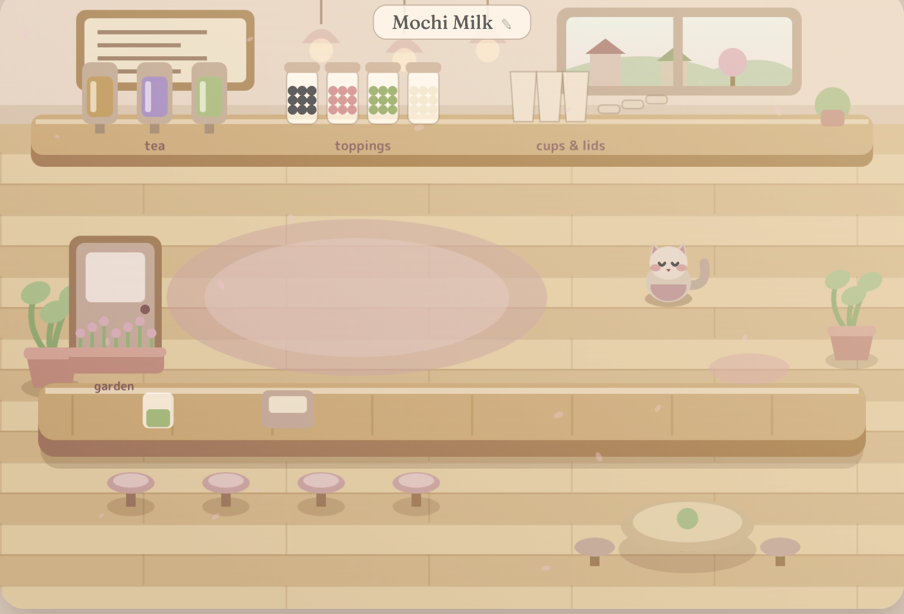

# Boba Bar

A cozy boba shop game. Make the drinks yourself, serve the regulars, and slowly turn a quiet little counter into a shop worth visiting.

**▶ [Play it here](https://mochiandmilk.github.io/boba-bar/)**

## What it is

You run a boba shop. Unlike most café games, you don't tap a button and watch a drink appear — you actually build it. Pick a tea base, pour it, drop in the toppings, seal the lid, and hand it over. Pour badly and it shows.

- **18 tea bases** and **15 toppings** to pour and mix
- **68 recipes** to discover by experimenting
- **38 things to buy** — cups, lids, toppings, pets, decorations
- **14 badges** to earn
- Regulars who come back, remember you, and have opinions
- A pastry case, a back room, a garden, and a cat

## How to play

Everything is clicking or tapping — no keyboard needed.

- **Tap the counter stations** to open them: tea, toppings, cups & lids
- **Tap a waiting customer** to hand over the drink you've made
- **Open the shop** from the sidebar to start a day
- **Notebook** tracks your recipes, badges, stats and regulars
- **Switch save** — three separate shops, if you want more than one

Works on phones and tablets as well as computers.

## Saving

The game saves by itself in your browser. Close the tab, come back, your shop is still there.

There's also a **Save code** button in the sidebar. It turns your whole shop into a block of text you can copy. Paste it into the game on a different device — phone, tablet, someone else's computer — and your shop shows up there. It's also worth grabbing one as a backup, since clearing your browser data will wipe the normal save.

## Built with

Plain HTML, CSS and JavaScript in a single file. No frameworks, no build step, no installing anything. Every graphic in the game is drawn in code — there isn't a single image file. Fonts are Fraunces and M PLUS Rounded 1c from Google Fonts.

To run it yourself, download `index.html` and open it in a browser. That's it.

## Credits

Made by **Rsaraswat**.

Inspired by cozy café games generally, but the drink-making is its own thing — building the drink layer by layer is the part I wanted to play and couldn't find.

---

© 2026 Rsaraswat. All rights reserved.

The code is here to look at, and the game is here to play. It isn't open source — please don't copy it, republish it, or sell it. If you want to use part of it for something, just ask.
